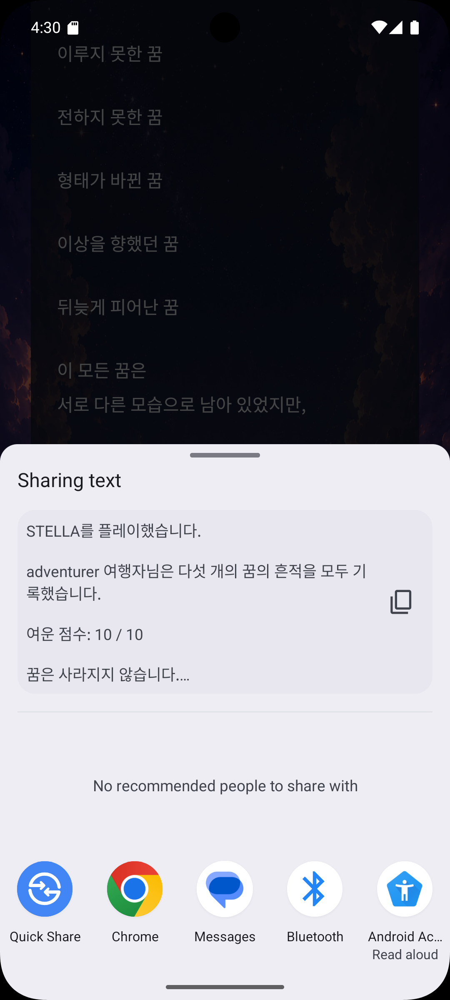

<div align="center">

#  Stella

### *꿈을 마주하는 이야기*

별을 선택하고 이야기를 따라가며,  
자신의 꿈을 마주하는 **Kotlin 기반 Android 스토리 게임**

<br>


<br><br>


</div>

---

## 📖 프로젝트 소개

**Stella**는 별을 매개로 여러 이야기를 경험하는  
스토리 중심의 Android 개인 프로젝트입니다.

플레이어는 별을 선택해 각 별에 담긴 이야기를 확인하고,  
화면의 흐름을 따라 결과와 엔딩에 도달하게 됩니다.

> **“한 편의 이야기를 직접 플레이한다.”**

단순히 화면을 넘기는 것을 넘어,  
이야기 속 선택과 결과를 통해 자신의 꿈을 돌아보는 경험을 목표로 제작했습니다.

---

## 🎮 진행 흐름

<div align="center">

`Main` → `Player` → `Star Select` → `Story` → `Result` → `Ending`

</div>

---

## ✨ 주요 기능

| 기능 | 설명 |
|---|---|
| ⭐ 별 선택 | 별을 선택해 각각의 이야기로 진입 |
| 📖 스토리 진행 | 화면 전환을 통해 이야기를 순차적으로 탐색 |
| 🎯 선택과 결과 | 사용자의 선택을 바탕으로 결과 화면 제공 |
| 🌅 엔딩 구성 | 이야기 진행을 마친 뒤 최종 엔딩 제공 |
| 📱 모바일 UI | Android 세로 화면에 맞춘 인터페이스 구성 |

---

## 📸 Screenshots

### 시작 화면

<div align="center">
  
</div>

<br>

### 별 선택

<div align="center">
  
</div>

<br>

### 이야기 진행

<p align="center">
  
  
  
</p>

<p align="center">
  
  
  
</p>

<br>

### 엔딩

<p align="center">
  
  
  
</p>

---

## 🛠 Tech Stack

| Category | Technology |
|---|---|
| Language | Kotlin |
| Platform | Android |
| IDE | Android Studio |
| Build Tool | Gradle Kotlin DSL |

---

## 📁 프로젝트 구성

```text
Stella/
├── app/                  # Android 애플리케이션 소스
├── docs/                 # README 이미지
├── gradle/               # Gradle Wrapper 설정
├── build.gradle.kts      # 프로젝트 빌드 설정
├── settings.gradle.kts   # 모듈 및 프로젝트 설정
└── README.md
```

---

## 💡 개발하며 배운 점

- Kotlin을 활용해 Android 애플리케이션을 처음부터 끝까지 구현했습니다.
- 여러 화면을 연결하며 사용자가 따라갈 수 있는 이야기 흐름을 설계했습니다.
- 사용자의 선택과 결과를 연결하는 상태 처리 방식을 경험했습니다.
- 모바일 세로 화면에 맞춰 콘텐츠와 UI를 배치하는 방법을 익혔습니다.
- 하나의 아이디어를 기획에서 구현과 완성까지 마무리하는 경험을 쌓았습니다.

---

## 🔧 개선하고 싶은 점

- 화면 전환 애니메이션과 상호작용 강화
- 사용자 선택에 따른 스토리 분기 확대
- 스토리 콘텐츠 및 엔딩 종류 확장
- 다양한 화면 크기에 대응하는 반응형 UI 개선
- 화면과 상태 처리 로직의 구조적 리팩터링

---

<div align="center">

### ⭐ Thank you for visiting Stella

*Every star has its own story.*

</div>
