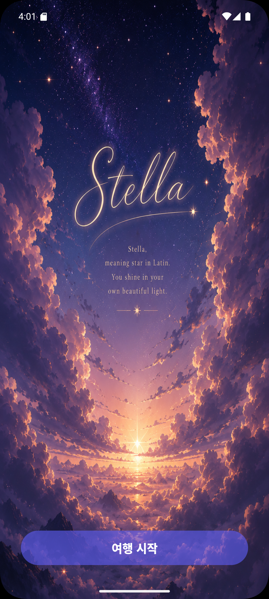
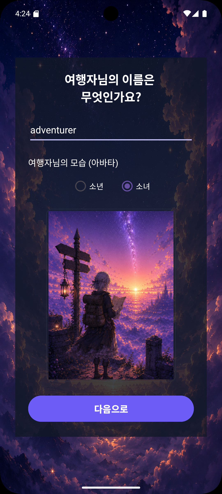
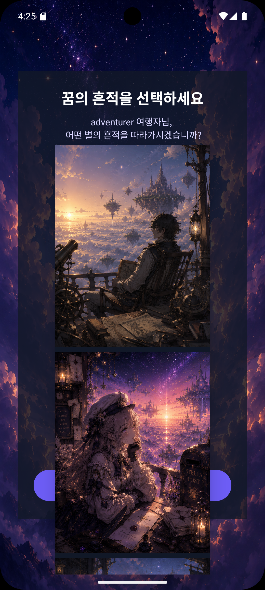

<div align="center">

# 🌌 Stella

### *꿈을 마주하는 이야기*

A story-driven adventure game developed with **Kotlin**

---



</div>

---

# 📖 Overview

**Stella**는 플레이어가 별을 수집하며
다양한 이야기와 선택을 경험하는
스토리 중심의 개인 프로젝트입니다.

단순한 게임 플레이보다

> **"한 편의 이야기를 플레이한다."**

라는 경험을 목표로 제작했습니다.

---

# ✨ Features

- ⭐ 별 수집 시스템
- 💬 NPC 대화 시스템
- 📚 스토리 진행
- 🎬 엔딩 시스템
- 💾 데이터 저장
- 🎵 배경음악 및 효과음

---

# 🖼 Screenshots

## Main Menu



---

## Gameplay



---

## Story


---

## Ending


---

# 🛠 Tech Stack

| Category | Tech |
|-----------|------|
| Language | Kotlin |
| IDE | Android Studio |
| Build | Gradle |

---

# 📂 Project Structure

```text
Stella
│
├── app
├── gradle
├── docs
│   ├── banner.png
│   ├── main.png
│   ├── gameplay.png
│   ├── story.png
│   └── ending.png
│
└── README.md
```

---

# 💡 What I Learned

이번 프로젝트를 통해

- Kotlin 문법
- 프로젝트 구조 설계
- 상태 관리
- 게임 로직 구현
- UI 구성

등의 기본기를 익혔습니다.

또한

프로젝트를 끝까지 완성하며

기획부터 구현까지

하나의 서비스를 마무리하는 경험을 얻었습니다.

---

# 🚀 Future Improvements

- Save/Load 기능 개선
- UI 리디자인
- 새로운 스토리 추가
- 다양한 엔딩 구현
- 사운드 품질 향상

---

<div align="center">

### ⭐ Thanks for visiting Stella ⭐

</div>
